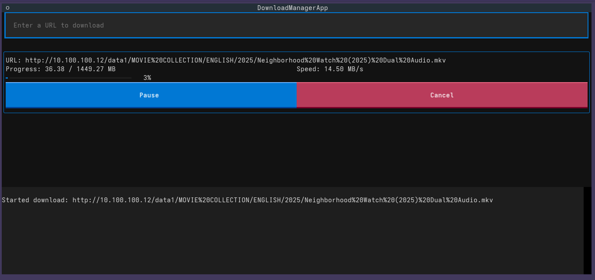

# Textual Download Manager

A simple, interactive command-line download manager built with Textual. This application allows you to download files from URLs, including YouTube videos (via `yt-dlp`), with features like progress tracking, speed display, and the ability to pause, resume, and cancel downloads.

## Features

- **Interactive TUI:** User-friendly Text User Interface built with the Textual framework.
- **General File Downloads:** Download any file from a given URL.
- **YouTube Video Downloads:** Seamlessly download YouTube videos using `yt-dlp`.
- **Progress Tracking:** Real-time display of download progress, total size, and download speed.
- **Pause/Resume:** Ability to pause and resume ongoing downloads.
- **Cancel Downloads:** Option to cancel downloads at any time.
- **Download History:** Logs all download activities to `download_history.log`.

## Installation

1.  **Clone the repository:**
    ```bash
    git clone https://github.com/your-username/textual-download-manager.git
    cd textual-download-manager
    ```

2.  **Install Python dependencies:**
    ```bash
    pip install -r requirements.txt
    ```

3.  **Install `yt-dlp` (for YouTube downloads):**
    `yt-dlp` is a powerful command-line program to download videos from YouTube. It is highly recommended for full functionality.

    **On Linux:**
    ```bash
    sudo wget https://github.com/yt-dlp/yt-dlp/releases/latest/download/yt-dlp -O /usr/local/bin/yt-dlp
    sudo chmod a+rx /usr/local/bin/yt-dlp
    ```
    Or using `pip`:
    ```bash
    pip install yt-dlp
    ```

    **On macOS:**
    ```bash
    brew install yt-dlp
    ```
    Or using `pip`:
    ```bash
    pip install yt-dlp
    ```

    **On Windows:**
    Download the `yt-dlp.exe` from the [official GitHub releases page](https://github.com/yt-dlp/yt-dlp/releases) and place it in a directory included in your system's PATH.
    Or using `pip`:
    ```bash
    pip install yt-dlp
    ```

## Usage

Here's a screenshot of the application in action:



To run the download manager, execute the Python script:

```bash
python download_manager.py
```

Once the application starts:
1.  Enter the URL of the file or YouTube video you wish to download into the input field at the top.
2.  Press `Enter` to start the download.
3.  You can pause, resume, or cancel downloads using the buttons next to each download item.
4.  Download progress and logs will be displayed in the respective sections.

Downloads will be saved in the `downloads/` directory within the project folder.

## Project Structure

```
.
├── download_history.log    # Log of all download activities
├── download_manager.py     # The main application script
├── downloads/              # Directory where downloaded files are stored
└── requirements.txt        # Python dependencies
```